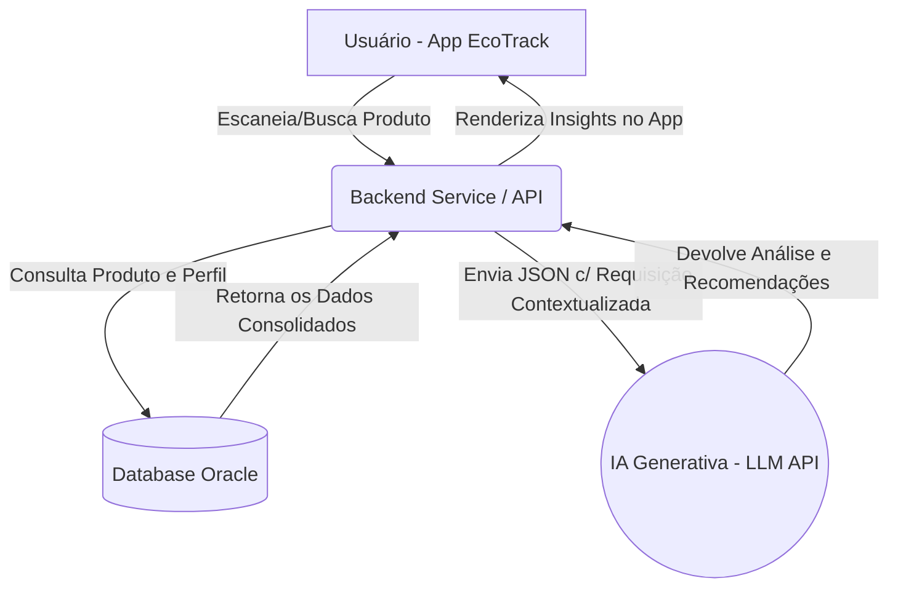

# Estratégia e Arquitetura de IA - EcoTrack

## 1. O Problema de IA a ser Resolvido
O EcoTrack visa empoderar os consumidores brasileiros, que frequentemente encontram dificuldade em compreender os rótulos complexos dos produtos em relação aos impactos nutricionais e ambientais.  
O sistema utilizará a IA para **traduzir dados técnicos em uma linguagem acessível** e **gerar automaticamente um resumo dos impactos de um produto, aliado a recomendações de alternativas mais saudáveis ou sustentáveis** baseadas no perfil do cliente.

## 2. Escolha do Modelo: LLM (IA Generativa)
**Tipo de Modelo:** IA Generativa baseada em grandes modelos de linguagem (LLM - *Large Language Model*), acessível via API REST (ex: OpenAI GPT-4 ou OCI Generative AI).

**Justificativa:** 
A complexidade de cruzar informações variadas (como lista de ingredientes, alergias, score ambiental e calórico) e retornar isso de forma didática para um consumidor não se resolve tão bem com simples regras fixas ou modelos de classificação simples. Um LLM consegue:
1. Compreender os dados técnicos em JSON e contextualizá-los.
2. Identificar correlações entre ingredientes nocivos e sugerir recomendações adaptadas.
3. Personalizar o tom da resposta com base nas preferências do usuário contidas no nosso banco de dados.

## 3. Identificação e Fluxo de Dados
A IA não será treinada do zero para este projeto. Utilizaremos a técnica de In-Context Learning (via prompt dinâmico no momento da requisição).

### A. Quais dados serão usados?
- **Origem dos Dados:** Informações de cadastro do usuário armazenadas no Banco de Dados (Oracle DB) + Banco de dados de produtos através de integração com APIs de produtos (ex: *Open Food Facts*).
- **Formato:** A IA receberá os dados já pré-processados pelo backend web/mobile em um formato **JSON**.
- **Quantidade Necessária:** Trata-se de uma interação sob demanda. No payload será enviado apenas o contexto específico de um produto (1 registro com a lista de ingredientes) e um perfil (1 registro do usuário).

### B. Estrutura do Payload (O que o Backend envia para a IA):
```json
{
  "usuario": {
    "idade": 25,
    "objetivos": "Reduzir consumo de açúcares e produtos com alta pegada de carbono",
    "restricoes": ["Intolerância à lactose"]
  },
  "produtoEscaneado": {
    "nome": "Biscoito Recheado X",
    "nutriScore": "E",
    "ecoScore": "D",
    "embalagem": "Plástico não reciclável",
    "ingredientesPrincipais": ["Açúcar", "Óleo de Palma", "Leite em pó Integral"]
  }
}
```

## 4. Fluxo de Funcionamento no Sistema
Quando o usuário aciona a funcionalidade:
1. **Acionamento:** O usuário acessa o aplicativo EcoTrack (Mobile/Web) e escaneia ou pesquisa o código de um produto.
2. **Coleta:** O Backend busca no Banco de Dados os detalhes técnicos recém obtidos do produto e resgata as de preferências daquele próprio usuário conectado.
3. **Requisição à IA:** O Backend formata o payload em JSON e envia um Request HTTP à API de IA Generativa.
4. **Análise IA:** O LLM avalia (ex: entende que o produto tem leite em pó, cruzando com a intolerância do usuário) e gera o insight de alerta focado em sustentabilidade (óleo de palma e plástico).
5. **Retorno GUI:** A interface centraliza e ilustra o resumo textualmente para o usuário, permitindo o engajamento com uma alternativa sugerida mais saudável.

## 5. Diagrama de Comunicação e Arquitetura


